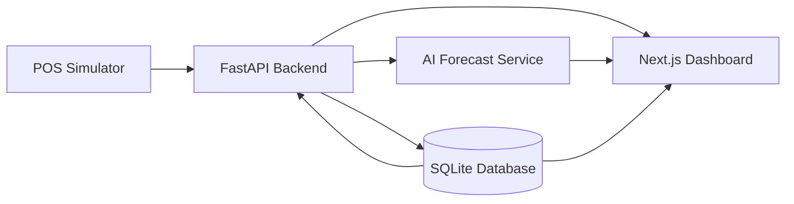
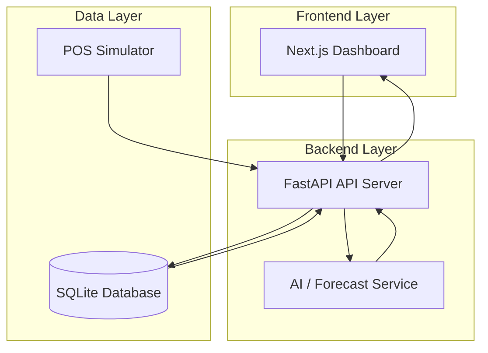
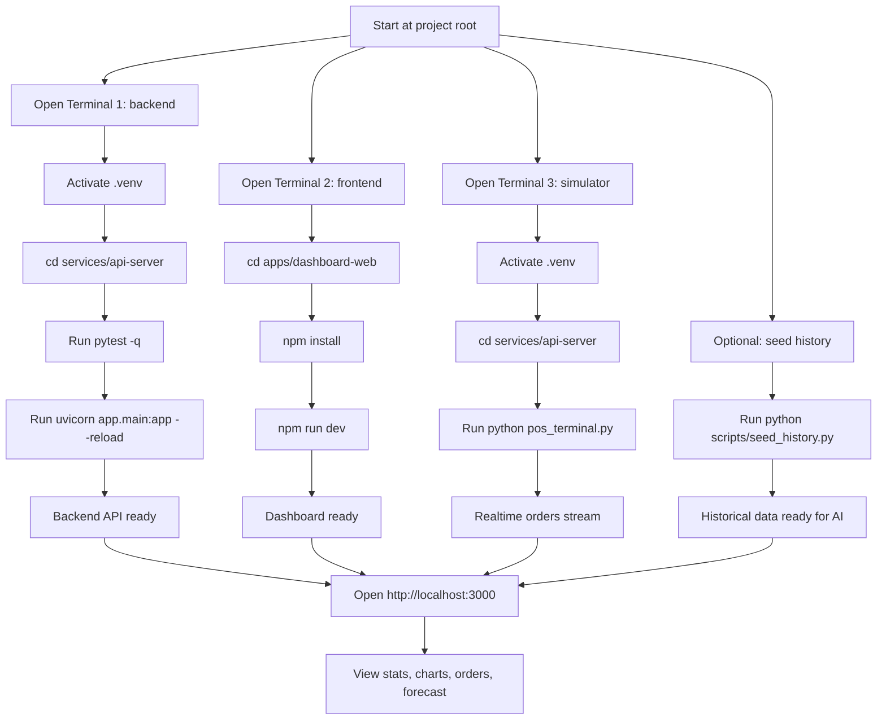

# Smart - pos - AI

**Smart - pos - AI** là tên dự án này: một hệ thống POS thông minh kết hợp dashboard realtime, phân tích doanh thu và dự báo AI để hỗ trợ ra quyết định cho cửa hàng/bán lẻ.

## 1. Mục đích dự án

Dự án được xây dựng để mô phỏng và hoàn thiện một luồng end-to-end thực tế:

- POS simulator tạo đơn hàng.
- API backend ghi dữ liệu vào cơ sở dữ liệu.
- Dashboard frontend hiển thị realtime.
- AI service phân tích, dự báo doanh thu và phát hiện bất thường.

Mục tiêu triển khai là biến dự án thành một hệ thống có thể chạy được, test được, mở rộng được và có cấu trúc đủ rõ để bàn giao hoặc tiếp tục phát triển.

## 2. Mô tả dự án

Đây là một nền tảng quản lý bán hàng thông minh gồm 3 lớp chính:

- **Frontend**: dashboard web cho người dùng theo dõi đơn hàng, doanh thu, biểu đồ và dự báo.
- **Backend**: API FastAPI xử lý đơn hàng, thống kê, forecasting và các endpoint phục vụ dashboard.
- **Simulator**: công cụ giả lập POS để đẩy dữ liệu thật vào hệ thống nhằm kiểm tra realtime flow.

Các chức năng chính hiện có:

- Tạo và xem đơn hàng.
- Dashboard thống kê doanh thu, tổng đơn, top sản phẩm.
- Biểu đồ doanh thu theo ngày.
- Dự báo doanh thu bằng AI.
- Phát hiện bất thường trong dữ liệu bán hàng.
- Kiểm tra realtime bằng POS simulator.

## 3. Cách chúng ta phát triển dự án

Tôi phát triển theo hướng sau:

- **Ưu tiên luồng end-to-end trước**: đảm bảo simulator -> API -> DB -> dashboard chạy thông suốt.
- **Sau đó mới siết chất lượng**: thêm migration, schema response, test, CI.
- **Tối ưu ít rủi ro trước**: đổi tên module theo hướng đúng chức năng nhưng vẫn giữ alias tương thích để không phá luồng cũ.
- **Xác thực liên tục**: mỗi thay đổi đều được chạy `pytest` để kiểm tra ngay.

Cách này giúp dự án không chỉ “chạy được” mà còn có nền tảng để mở rộng tiếp.

## 4. Công nghệ sử dụng

### Backend
- **FastAPI**: xây dựng API nhanh, rõ ràng, hỗ trợ validation tốt.
- **SQLAlchemy 2.x**: ORM làm việc với database.
- **Pydantic v2**: validate request/response schema.
- **Alembic**: quản lý migrations.
- **SQLite**: database local cho dev/test.
- **scikit-learn / numpy / pandas**: phục vụ logic AI/forecasting.

### Frontend
- **Next.js**: giao diện web.
- **TypeScript**: tăng độ an toàn kiểu dữ liệu.
- **Tailwind CSS**: dựng UI nhanh và đồng bộ.
- **Recharts**: biểu đồ.
- **Axios**: gọi API.

### Tooling
- **pytest**: test backend.
- **GitHub Actions**: CI chạy migration và test.
- **PowerShell / Windows**: môi trường phát triển chính trong workspace này.

## 5. Kết quả đã triển khai

- Tạo backend FastAPI và các router chính.
- Hoàn thiện luồng tạo đơn hàng.
- Kết nối dashboard realtime với dữ liệu thật.
- Sửa lỗi forecasting AI do sai kiểu dữ liệu.
- Thêm seeder để tạo dữ liệu lịch sử nhiều ngày.
- Thêm Alembic migrations.
- Chuẩn hóa response models cho dashboard và AI.
- Thêm test cho orders, dashboard và AI.
- Thêm CI workflow chạy migrations + tests.
- Tối ưu cấu trúc package Python và giảm warning Pydantic.
- Refactor naming nội bộ từ `sales` sang `order_analytics` nhưng vẫn giữ tương thích cũ.

## 6. Kiến trúc dự án

```text
smart-pos-ai/
├── apps/
│   └── dashboard-web/        # Next.js frontend
├── services/
│   ├── api-server/           # FastAPI backend
│   └── pos-simulator/        # Mô phỏng POS
├── infra/                    # cấu hình hạ tầng
├── packages/                 # shared packages
└── README.md
```







Backend chính nằm ở `services/api-server`:

- `app/main.py`: khởi tạo FastAPI.
- `app/routers/`: các endpoint orders, analytics, ai.
- `app/services/`: logic nghiệp vụ và AI.
- `app/models/`: ORM models và Pydantic schemas.
- `alembic/`: migration.
- `tests/`: test backend.
- `pos_terminal.py`: simulator tạo đơn hàng.

## 7. Kế hoạch phát triển tiếp theo

- Bổ sung xác thực người dùng (JWT/login).
- Tách rõ hơn module domain và service layer.
- Làm realtime tốt hơn bằng WebSocket/SSE.
- Nâng cấp AI forecasting với mô hình mạnh hơn.
- Thêm export báo cáo PDF/Excel.
- Chuẩn bị triển khai production bằng Docker/Kubernetes hoặc cloud.
- Làm mobile app hoặc companion app nếu cần.

## 8. Cách chạy dự án để test đầy đủ

Nếu bạn muốn bản rút gọn, mở [QUICK_RUN.md](QUICK_RUN.md).

### Yêu cầu môi trường
- Python 3.13+ (đúng với workspace hiện tại).
- Node.js 18+.
- npm.
- Terminal PowerShell trên Windows.

### 8.1 Chạy backend

Nếu bạn mở terminal ngay tại thư mục gốc dự án `C:\ABE\smart-pos-ai`:

```powershell
& .\.venv\Scripts\Activate.ps1
cd services\api-server
pytest -q
uvicorn app.main:app --reload
```

Nếu terminal của bạn đã ở sẵn `services\api-server` và `.venv` đã được activate, chỉ cần chạy:

```powershell
pytest -q
uvicorn app.main:app --reload
```

Backend sẽ chạy tại:
- API: `http://127.0.0.1:8000`
- Docs: `http://127.0.0.1:8000/docs`

### 8.2 Chạy frontend

```powershell
cd apps\dashboard-web
npm install
npm run dev
```

Lưu ý: `npm run dev` sẽ giữ terminal chạy liên tục, đây là hành vi bình thường.

Frontend sẽ chạy tại:
- Dashboard: `http://localhost:3000`

### 8.3 Chạy POS simulator

Mở terminal khác:

```powershell
cd services/api-server
& ..\..\.venv\Scripts\Activate.ps1
python pos_terminal.py
```

Simulator sẽ đẩy đơn hàng mới liên tục để dashboard cập nhật realtime.

### 8.4 Seed dữ liệu lịch sử để AI forecast hoạt động tốt hơn

Nếu muốn xem forecast đầy đủ, cần dữ liệu lịch sử nhiều ngày:

```powershell
cd services/api-server
& ..\..\.venv\Scripts\Activate.ps1
python scripts/seed_history.py
```

### 8.5 Kiểm tra luồng đầy đủ

Sau khi chạy đủ 3 thành phần trên:

1. Mở `http://localhost:3000`.
2. Vào trang dashboard.
3. Kiểm tra:
   - Stats cards.
   - Biểu đồ doanh thu.
   - Top products.
   - Danh sách orders realtime.
   - AI revenue forecast.
4. Mở `http://127.0.0.1:8000/docs` để test API trực tiếp.

## 9. Các endpoint chính

### Dashboard
- `GET /api/v1/dashboard`
- `GET /api/v1/dashboard/stats`
- `GET /api/v1/dashboard/sales/daily?days=30`
- `GET /api/v1/dashboard/products/top?limit=10`

### Orders
- `GET /api/v1/orders`
- `GET /api/v1/orders/recent?limit=20`
- `POST /api/v1/orders`

### AI
- `GET /api/v1/ai/forecast/revenue?days=30`
- `GET /api/v1/ai/forecast/product/{product_name}`
- `GET /api/v1/ai/anomalies?threshold=2.0`

## 10. Kiểm thử toàn bộ chức năng

### Chạy test backend

```powershell
cd services/api-server
pytest -q
```

### Kiểm tra API nhanh

- `GET http://127.0.0.1:8000/health`
- `GET http://127.0.0.1:8000/api/v1/dashboard`
- `GET http://127.0.0.1:8000/api/v1/orders/recent?limit=5`
- `GET http://127.0.0.1:8000/api/v1/ai/forecast/revenue?days=7`

### Kiểm tra UI

- Dashboard page.
- Orders page.
- Analytics page.
- Forecast page.

## 11. Troubleshooting nhanh

### Frontend không gọi được API
- Kiểm tra backend đã chạy chưa.
- Kiểm tra biến môi trường `NEXT_PUBLIC_API_URL`.
- Kiểm tra CORS trong backend.

### Dashboard không có dữ liệu
- Chạy `pos_terminal.py` để sinh order.
- Chạy `scripts/seed_history.py` nếu muốn có dữ liệu lịch sử.

### Forecast trống
- Cần đủ dữ liệu lịch sử.
- Dữ liệu ít quá thì AI service sẽ trả về forecast hạn chế.

### Lỗi import Python
- Luôn chạy test/backend từ `services/api-server`.
- Dùng virtual environment của workspace.

## 12. Phát hành và CI

Đã có workflow GitHub Actions để:

- Cài dependencies.
- Chạy Alembic migrations.
- Chạy test backend.

Điều này giúp dự án có nền tảng kiểm soát chất lượng trước khi deploy.

---
